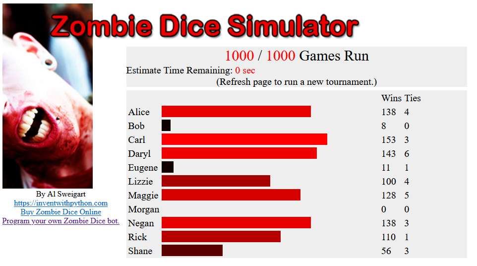

# Zombie Dice Bots

This is my solution to the final practice project from [Chapter 6](https://automatetheboringstuff.com/2e/chapter6/) of Automate the Boring Stuff with Python. You can find the complete rules and the rest of the code at https://github.com/asweigart/zombiedice/.

I met these requirements:

* A bot that, after the first roll, randomly decides if it will continue or stop
* A bot that stops rolling after it has rolled two brains
* A bot that stops rolling after it has rolled two shotguns
* A bot that initially decides it’ll roll the dice one to four times, but will stop early if it rolls two shotguns
* A bot that stops rolling after it has rolled more shotguns than brains

But decided to experiment and make more bots. I made at least 10. Other than Alice and Bob they are all named after Walking Dead characters. So far Carl has the best strategy, he rolls until he gets 2 shot guns (unless he has 0 brains then keeps going) and if he has 1 shotgun he keeps going unless he has at least 6 brains. At the moment Lizzie is the only bot that makes decisions based on the color of the dice.

To run this code you must install the zombiedice module by typing `pip install zombiedice` in the terminal.